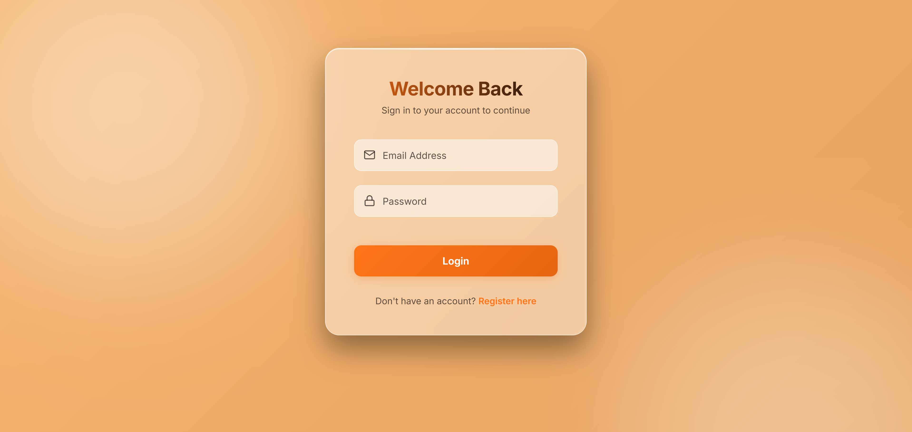
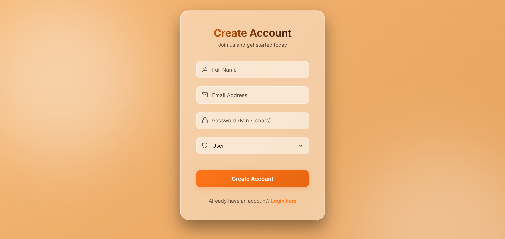
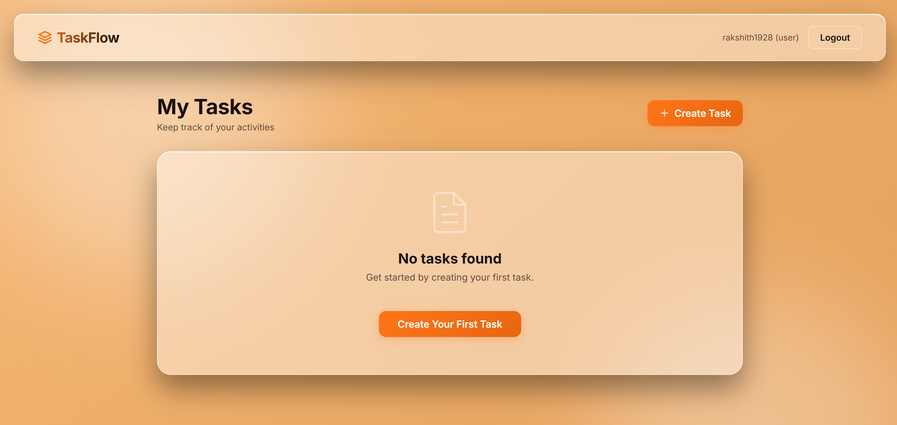

# TaskFlow

A robust, scalable REST API built with **Node.js, Express, and MongoDB**, paired with a modern **React + Vite** frontend interface featuring a premium glassmorphic design. TaskFlow focuses heavily on security, modularity, and deployment readiness, offering a seamless and beautiful task management experience.

---

## 📸 Showcase

<div align="center">
  <h3>Authentication & Dashboard</h3>
  <p>A completely customized, responsive light theme featuring dynamic floating labels and SVG iconography.</p>
  
  
  
  
</div>

---

## 🏗 Database Design (MongoDB + Mongoose)

The application utilizes MongoDB (a NoSQL database) for flexible, high-performance data storage. The schemas are strictly defined using Mongoose to ensure data integrity and validation before database insertion.

### 1. User Schema
Handles authentication and Role-Based Access Control (RBAC).
- `name`: String (Required)
- `email`: String (Required, Unique, Regex Validated)
- `password`: String (Required, Minimum 6 characters, Hashed via bcryptjs)
- `role`: String (Enum: `['user', 'admin']`, Default: `'user'`)
- `createdAt`: Date

### 2. Task Schema
The primary entity managed by the users.
- `title`: String (Required, Max 100 characters)
- `description`: String (Required, Max 500 characters)
- `status`: String (Enum: `['pending', 'in-progress', 'completed']`, Default: `'pending'`)
- `user`: ObjectId (Hard Reference to the User Schema)
- `createdAt`: Date

**Relational Mapping:** The `user` field in the Task schema establishes a strict one-to-many relationship, allowing the application to populate task ownership dynamically.

---

## 🔒 Security Practices & Authentication

- **Stateless Authentication**: Uses JSON Web Tokens (JWT) for secure, stateless session management.
- **Password Protection**: Passwords are mathematically hashed using `bcryptjs` (with a 10-round salt) before database insertion. Passwords are never returned in API responses.
- **Role-Based Access Control (RBAC)**: Includes dedicated `protect` and `authorize` middlewares. A standard `user` can only manipulate their own tasks, while an `admin` has elevated privileges across the entire dataset.
- **Input Validation**: Mongoose handles strict schema validation (e.g., preventing invalid emails or exceedingly long strings).

---

## 📚 API Documentation & Explanation

The backend follows strict REST principles. Responses utilize standardized HTTP status codes (`200 OK`, `201 Created`, `400 Bad Request`, `401 Unauthorized`, `403 Forbidden`, `404 Not Found`, `500 Server Error`).

### Authentication Endpoints (`/api/v1/auth`)
| Method | Endpoint | Description | Access |
|---|---|---|---|
| POST | `/register` | Register a new user | Public |
| POST | `/login` | Authenticate user & get JWT | Public |
| GET | `/me` | Get current logged-in user profile | Private |

### Task Endpoints (`/api/v1/tasks`)
| Method | Endpoint | Description | Access |
|---|---|---|---|
| GET | `/` | Get all tasks (Admins get all, Users get theirs) | Private |
| POST | `/` | Create a new task | Private |
| GET | `/:id` | Get a specific task | Private |
| PUT | `/:id` | Update a specific task | Private |
| DELETE | `/:id` | Delete a specific task | Private |

### Swagger UI Integration
Interactive API documentation is built directly into the application using `swagger-ui-express`. 
Once the server is running, navigate to: **`http://localhost:5000/api-docs`** to view and test all endpoints dynamically.

---

## 🚀 Local Setup Instructions (Without Docker)

To run this application locally using Node, you will need two separate terminal windows.

### 1. MongoDB Setup
1. Create a `.env` file in the `backend/` directory.
2. Add your MongoDB Atlas connection string (or local MongoDB URI) and a JWT Secret:
```env
PORT=5000
MONGO_URI=mongodb+srv://<username>:<password>@<cluster-url>/<db-name>?retryWrites=true&w=majority
JWT_SECRET=your_super_secret_jwt_key_here
```
*(Note: If you encounter `querySrv ECONNREFUSED` errors, ensure your current IP address is whitelisted in the MongoDB Atlas Network Access settings).*

### 2. Running the Backend API
In your first terminal:
```bash
cd backend
npm install
npm run dev
```
The API will be live at `http://localhost:5000`.

### 3. Running the Frontend Dashboard
In your second terminal:
```bash
cd frontend
npm install
npm run dev
```
The React application will be live at `http://localhost:5173`.

---

## 🐳 Docker Deployment Setup

The repository is fully Dockerized for immediate, isolated production deployment. It contains Dockerfiles for both services and a root `docker-compose.yml`. 
- **Backend:** Containerized in a lightweight Node Alpine environment.
- **Frontend:** Multi-stage build compiled via Vite and served using a production-grade **Nginx** container.

### Running with Docker Compose
1. Ensure your `backend/.env` file is configured with your `MONGO_URI`.
2. From the root directory of the project, run:
```bash
docker-compose up --build -d
```
3. The services will automatically link and start:
   - **Frontend:** Available at `http://localhost:80`
   - **Backend API:** Available at `http://localhost:5000`

To stop the containers, run `docker-compose down`.

---

## 📈 Scalability Note

Designing for the future requires decoupling and statelessness. This architecture is prepared for enterprise-scale traffic:

1. **Horizontal Scaling & Microservices:** Because the authentication layer uses **JWT**, the backend is completely stateless. This means we are not reliant on server memory or sticky sessions. The Express app can be orchestrated via **Kubernetes**. If the `Task` entity grows into a massive service, its routes and controllers can be safely extracted into an independent microservice.
2. **Caching Strategy:** Currently, every `GET` request hits MongoDB. As read volume scales, we would introduce **Redis** as an in-memory caching layer. Write operations (`POST`, `PUT`, `DELETE`) would invalidate specific Redis cache keys to ensure data consistency, dramatically reducing the load on the primary database.
3. **Load Balancing & Reverse Proxy:** The Node.js instances are designed to sit behind an **Nginx** reverse proxy (as demonstrated in the Frontend Dockerfile) or an AWS Application Load Balancer (ALB). This provides SSL termination, mitigates DDoS attacks, and distributes incoming traffic evenly across multiple Node instances, ensuring high availability.
